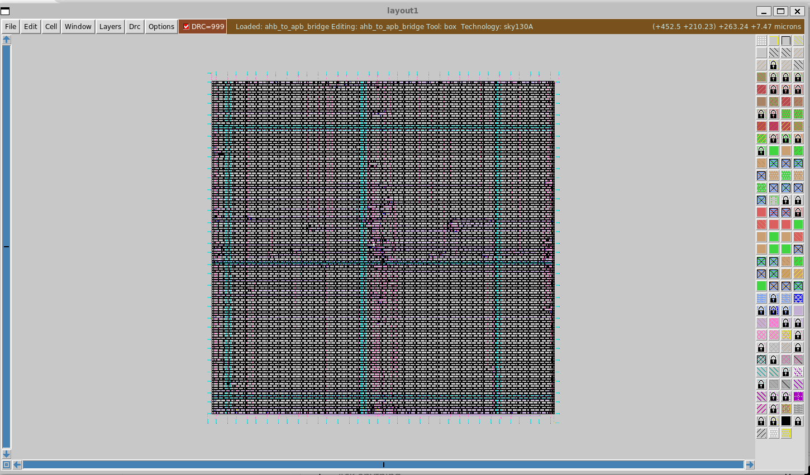

# AHB to APB Bridge ASIC Design using OpenLane

## Project Overview

This project implements an **AHB to APB Bridge** using Verilog RTL and performs a complete ASIC implementation flow using:

* OpenLane
* OpenROAD
* Sky130 PDK
* Magic VLSI
* Docker
* WSL
* Vivado (for RTL simulation)

The project successfully generated:

* Synthesized netlist
* Floorplan
* Placement
* Clock Tree Synthesis (CTS)
* Routing
* GDSII Layout

---

# ASIC Design Flow

```text
RTL Design
   ↓
Functional Verification
   ↓
RTL Synthesis
   ↓
Floorplanning
   ↓
Placement
   ↓
Clock Tree Synthesis (CTS)
   ↓
Routing
   ↓
Timing & DRC Checks
   ↓
GDSII Generation
```

---

# OpenLane Physical Design Flow

```text
Verilog RTL
   ↓
Yosys Synthesis
   ↓
Floorplanning
   ↓
Power Distribution Network (PDN)
   ↓
Placement
   ↓
CTS
   ↓
Global Routing
   ↓
Detailed Routing
   ↓
STA & Signoff
   ↓
Final GDSII Layout
```

---

# ASIC Design Flow Explanation

## 1. RTL Design (Verilog)

### Tool Used:

* Vivado
* Verilog HDL

### Purpose:

RTL (Register Transfer Level) design describes the hardware behavior.

In this project:

* AHB acts as high-speed bus
* APB acts as low-power peripheral bus
* Bridge converts AHB transactions into APB transactions

Main file:

```verilog
ahb_to_apb_bridge.v
```

---

# 2. Testbench and Simulation

### Tool Used:

* Vivado Simulator (XSim)

### Purpose:

Simulation verifies whether RTL logic works correctly before ASIC implementation.

Testbench applied:

* Clock generation
* Reset
* AHB write transactions
* Signal verification

Output checked:

* PADDR
* PWDATA
* PWRITE
* PSEL
* PENABLE

---

# 3. Synthesis

### Tool Used:

* Yosys (inside OpenLane)

### Purpose:

Converts RTL Verilog into gate-level netlist using Sky130 standard cells.

Example:

```text
always @(posedge clk)
```

gets converted into:

* flip-flops
* logic gates
* muxes
* buffers

Output:

* synthesized netlist

---

# 4. Floorplanning

### Tool Used:

* OpenROAD

### Purpose:

Defines:

* chip area
* core area
* IO placement
* power distribution

This determines how the ASIC layout is organized physically.

---

# 5. Placement

### Tool Used:

* RePlAce (inside OpenROAD)

### Purpose:

Places standard cells physically on the chip.

Examples:

* AND gates
* OR gates
* Flip-flops
* Buffers

Placement optimizes:

* area
* timing
* congestion

---

# 6. Clock Tree Synthesis (CTS)

### Tool Used:

* TritonCTS

### Purpose:

Creates clock distribution network.

Ensures:

* clock reaches all flip-flops
* low clock skew
* balanced timing

---

# 7. Routing

### Tool Used:

* FastRoute + TritonRoute

### Purpose:

Connects all placed cells using metal routing layers.

Creates:

* signal routes
* power routes
* clock routes

This generates real physical interconnections.

---

# 8. Signoff Checks

### Tool Used:

* OpenSTA
* Magic

### Purpose:

Checks:

* timing violations
* setup violations
* hold violations
* DRC checks

Project Result:

* No setup violations
* No hold violations
* GDS generated successfully

---

# 9. GDSII Generation

### Tool Used:

* Magic VLSI
* OpenLane

### Purpose:

Generates final fabrication-ready layout file.

Output:

```text
ahb_to_apb_bridge.gds
```

This is the final file used for chip fabrication.

---

# Tools Used and Their Purpose

| Tool        | Purpose                                         |
| ----------- | ----------------------------------------------- |
| Vivado      | RTL simulation and synthesis testing            |
| Docker      | Runs OpenLane environment in isolated container |
| WSL         | Linux environment inside Windows                |
| OpenLane    | Complete RTL-to-GDS ASIC flow                   |
| OpenROAD    | Physical design automation                      |
| Yosys       | RTL synthesis                                   |
| TritonRoute | Detailed routing                                |
| TritonCTS   | Clock tree synthesis                            |
| OpenSTA     | Static timing analysis                          |
| Magic       | Layout viewing and DRC                          |
| Sky130 PDK  | 130nm fabrication technology library            |
| KLayout     | GDSII layout viewer                             |

---

# What is Sky130?

Sky130 is an open-source 130nm ASIC fabrication technology provided by:

* Google
* SkyWater
* Efabless

It provides:

* standard cells
* transistor models
* routing layers
* design rules
* timing libraries

Without a PDK, ASIC design cannot be fabricated.

---

# Why Docker Was Used

OpenLane requires many Linux EDA tools.

Docker provides:

* isolated environment
* dependency management
* reproducible ASIC flow

Without Docker, installing all ASIC tools manually is extremely difficult.

---

# Final Outputs Generated

* RTL Verilog
* Testbench
* Synthesized netlist
* DEF
* LEF
* GDSII
* Layout screenshots
* Timing reports
* Manufacturability reports

---

# Final Result

Successfully implemented an:

## AHB to APB Bridge ASIC

using:

* Verilog RTL
* OpenLane
* Sky130 PDK

and generated final:

## GDSII Layout

for ASIC fabrication flow.

---

# Suggested GitHub Folder Structure

```text
AHB_to_APB_ASIC_Project/
│
├── rtl/
│   └── ahb_to_apb_bridge.v
│
├── testbench/
│   └── tb_ahb_to_apb_bridge.v
│
├── gds/
│   └── ahb_to_apb_bridge.gds
│
├── screenshots/
│   └── final_asic_layout.png
│
├── reports/
│   ├── metrics.csv
│   └── manufacturability.rpt
│
└── README.md
```## ASIC Design Flow

1. RTL Design (Verilog)
2. Functional Simulation
3. Synthesis
4. Floorplanning
5. Placement
6. Clock Tree Synthesis (CTS)
7. Routing
8. DRC/LVS Checks
9. GDSII Generation

---

## Tools Used

| Tool | Purpose |
|------|----------|
| OpenLane | Complete RTL-to-GDS flow |
| OpenROAD | Physical design automation |
| Sky130 PDK | 130nm fabrication technology |
| Magic VLSI | Layout viewing and DRC |
| KLayout | GDS visualization |
| Docker | Tool environment |
| WSL | Linux environment on Windows |

---

## Generated Outputs

- RTL Verilog
- Testbench
- Final GDSII Layout
- Manufacturability Report
- Metrics Report
- Layout Screenshot

---

## Final Layout



---

# Resume Description

Designed and implemented an AHB-to-APB Bridge ASIC using Verilog HDL and OpenLane RTL-to-GDSII flow on Sky130 PDK. Performed synthesis, floorplanning, placement, CTS, routing, timing analysis, and generated final GDSII layout using open-source ASIC design tools.
